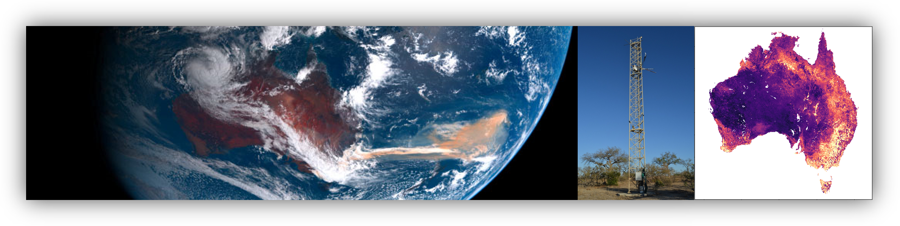

# AusEFlux: Empirical upscaling of terrestrial carbon fluxes over Australia using the OzFlux eddy covariance network

The notebooks in this repository develop an **operational workflow for production of AusEFlux**. This repository differs from the [NEE_modelling](https://github.com/cbur24/NEE_modelling) repo which describes the research methods that inform [EGU Biogeosciences publication](https://doi.org/10.5194/bg-20-4109-2023) _Empirical upscaling of OzFlux eddy covariance for high-resolution monitoring of terrestrial carbon uptake in Australia_

AusEFlux (**Aus**tralian **E**mpirical **Flux**es) is a high resolution (1 km) gridded estimate of Gross Primary Productivity, Ecosystem Respiration, and Net Ecosystem Exchange over the Australian continent for the period January 2003 to June 2022.  This new estimate of Australia’s terrestrial carbon cycle provides a benchmark for assessment against Land Surface Model simulations, and a means for monitoring of Australia’s terrestrial carbon cycle at an unprecedented high-resolution.

**License:** The code in this repository is licensed under the [Apache License, Version 2.0](https://www.apache.org/licenses/LICENSE-2.0)
